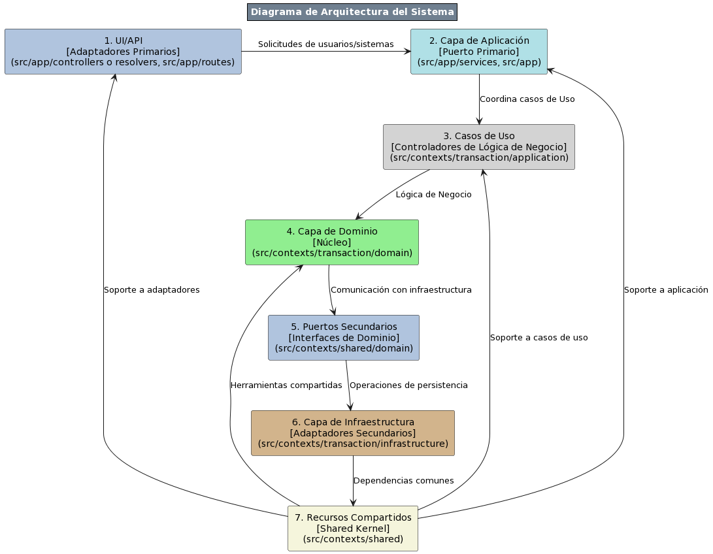

# Proyecto - Transacciones Financieras

Este proyecto se centra en el desarrollo de un sistema avanzado de procesamiento de transacciones financieras. Diseñado para manejar de manera eficiente y segura una amplia gama de operaciones financieras, el sistema aborda desafíos críticos como la detección de fraudes, la gestión de estados de transacción y la integración de múltiples servicios en una arquitectura robusta y escalable.


**Arquitectura y Patrones de Diseño**:  
Los servicios (TCS, FDS y TSUS) se han implementado siguiendo una arquitectura hexagonal y los principios de Domain-Driven Design (DDD), lo que facilita una clara separación entre la lógica del negocio y las interacciones externas. Utiliza Command Query Responsibility Segregation (CQRS) para diferenciar entre las operaciones de lectura y escritura, y aplica Event Sourcing para mantener un registro completo y secuencial de todos los cambios en el estado de las transacciones, lo que mejora la escalabilidad, trazabilidad y la capacidad de auditoría del sistema.



#### **UI/API [Adaptadores Primarios]** - [1]
**Función**: Interfaz de usuario y puntos de entrada de la API.  
**Componentes**: Controladores o resolvers (src/app/controllers), Rutas (src/app/routes).  
**Descripción**: Gestiona las solicitudes entrantes de los usuarios o sistemas externos y las redirige a la capa de aplicación.

#### **Capa de Aplicación [Puerto Primario]** - [2]
**Función**: Orquestación de la lógica de aplicación.  
**Componentes**: Servicios (src/app/services), Configuraciones generales (src/app).  
**Descripción**: Coordina los casos de uso, procesando datos y lógica de negocio, y los envía a la capa correspondiente.

#### **Casos de Uso [Controladores de Lógica de Negocio]** - [3]
**Función**: Manejo específico de casos de uso de la lógica de negocio.  
**Componentes**: Módulos de casos de uso (src/contexts/transaction/application).  
**Descripción**: Implementa la lógica específica de los casos de uso, como procesos de transacción, validaciones y reglas de negocio.

#### **Capa de Dominio [Núcleo]** - [4]
**Función**: Núcleo de la lógica de negocio.  
**Componentes**: Entidades y lógica de dominio (src/contexts/transaction/domain).  
**Descripción**: Contiene la lógica de negocio esencial y las reglas del dominio, modelando los objetos y procesos del negocio.

#### **Puertos Secundarios [Interfaces de Dominio]** - [5]
**Función**: Interfaces para la comunicación externa.  
**Componentes**: Interfaces de dominio (src/contexts/shared/domain).  
**Descripción**: Proporciona puntos de integración y comunicación con sistemas externos o con la capa de infraestructura.

#### **Capa de Infraestructura [Adaptadores Secundarios]** - [6]
**Función**: Implementaciones técnicas y de soporte.  
**Componentes**: Implementaciones de infraestructura (src/contexts/transaction/infrastructure).  
**Descripción**: Maneja las operaciones de persistencia, conexiones a bases de datos y la interacción con servicios externos.

#### **Recursos Compartidos [Shared Kernel]** - [7]
**Función**: Código y funcionalidades comunes.  
**Componentes**: Código compartido (src/contexts/shared).  
**Descripción**: Incluye herramientas, utilidades y código que es compartido entre diferentes partes del sistema, proporcionando una base común y reduciendo la duplicidad.


## Comenzando

# Configuración de Servicios y Kafka en el Proyecto Yape

Este proyecto utiliza una configuración avanzada de Kafka para asegurar la idempotencia y garantizar la entrega exactly-once de los mensajes. Esto es crucial para mantener la consistencia y fiabilidad en un sistema de procesamiento de transacciones financieras.

## Transacciones, Idempotencia y Entrega Exactly-Once en Kafka

En el contexto de sistemas de mensajería como Kafka, se combinan tres conceptos clave para asegurar la integridad y confiabilidad en el manejo de mensajes, especialmente importante en sistemas financieros como el que estamos desarrollando.

### Transacciones

Las transacciones en Kafka permiten agrupar múltiples operaciones de envío de mensajes en una única unidad atómica. Esto significa que o bien todas las operaciones en la transacción se ejecutan con éxito, o ninguna se lleva a cabo. Las transacciones son fundamentales para mantener la consistencia de los datos a través del sistema, evitando estados parciales o inconsistentes.

### Idempotencia

La idempotencia en Kafka asegura que, incluso si un mensaje se envía más de una vez (por ejemplo, en caso de un fallo y reintento), no se producirán efectos secundarios adicionales. Un mensaje idempotente puede ser procesado repetidamente pero con el efecto de una única operación. Esto es vital para evitar duplicados en operaciones críticas, como transacciones financieras.

### Entrega Exactly-Once

La garantía de entrega "exactly-once" combina transacciones e idempotencia. Asegura que cada mensaje se entrega y procesa exactamente una vez, ni más ni menos. Esto es especialmente crítico en aplicaciones donde la duplicación o pérdida de mensajes podría tener consecuencias graves, como en los sistemas de procesamiento de pagos o transacciones financieras.

### Impacto de la Combinación de Estas Características

Al combinar transacciones, idempotencia y la garantía de entrega exactly-once, Kafka se convierte en una herramienta extremadamente poderosa y confiable para sistemas que requieren alta integridad y fiabilidad en el manejo de datos, como es el caso en nuestro sistema financiero. Esta configuración asegura que:

- Cada transacción se procesa de manera integral, sin dejar operaciones a medias.
- Los mensajes procesados más de una vez no crean duplicados.
- Cada mensaje es entregado y procesado una sola vez, garantizando la precisión y consistencia de los datos a través de todo el sistema.

Estás prácticas se ha incluido para garantizar la calidad y fiabilidad en el procesamiento de transacciones financieras.

## Servicios

El proyecto consta de varios servicios que trabajan en conjunto para proporcionar la funcionalidad completa de la aplicación. Cada servicio se ejecuta en un contenedor Docker y está definido en el archivo `docker-compose.yml`. A continuación, se detallan los servicios y sus roles dentro de la arquitectura:

#### **Transaction Creation Service (TCS)**

**Función**:  
Manejar la recepción y el registro inicial de transacciones financieras.

**Descripción**:  
El Transaction Creation Service (TCS) procesa las solicitudes entrantes de creación de transacciones. Valida y registra las transacciones con un estado inicial 'pendiente'. Una vez registradas, el servicio publica un evento de 'transacción creada' en Kafka, facilitando la comunicación asíncrona con otros servicios que procesarán la transacción en fases subsiguientes.

#### **Fraud Detection Service (FDS) - FraudValidationService**

**Función**:  
Realizar la validación antifraude de las transacciones financieras.

**Descripción**:  
Específicamente el FraudValidationService, se encarga de consumir eventos de 'transacción creada' desde Kafka. Aplica una serie de reglas de validación antifraude, incluyendo el rechazo de transacciones que superen los 1000 en valor. Posteriormente, según el resultado de la validación, emite eventos de 'estado de transacción actualizado' (ya sea aprobado o rechazado) de vuelta a Kafka. Este servicio es un componente crítico para asegurar la integridad y seguridad en el procesamiento de transacciones financieras.

#### **Transaction Status Update Service (TSUS)**

**Función**:  
Actualizar el estado de las transacciones en la base de datos.

**Descripción**:  
Este servicio, conocido como Transaction Status Update Service (TSUS), es responsable de consumir los eventos de 'estado de transacción actualizado' desde Kafka. Luego, procede a actualizar el estado correspondiente de las transacciones en la base de datos. Su función es crucial para mantener la consistencia y la precisión del estado de las transacciones a lo largo del ciclo de vida de las mismas.

### Prerrequisitos
Antes de comenzar, asegúrate de tener instalado [Docker](https://www.docker.com/) y [Docker Compose](https://docs.docker.com/compose/install/) en tu sistema. Esto es necesario para construir y ejecutar los contenedores definidos en el archivo `docker-compose.yml`.

Para clonar el repositorio y ejecutar el proyecto, sigue estos pasos:

```bash
# Clonar el repositorio
git clone https://github.com/sistemas0011ff/RetoTecnicoYape.git

# Cambiar al directorio del proyecto
cd carpeta_del_proycto

# Construir y ejecutar los servicios con Docker Compose
docker-compose up --build
```

### Endpoint de GraphQL

Para interactuar con la API GraphQL, utiliza la siguiente URL en tu entorno de desarrollo local:
[https://localhost:8080/graphql](http://localhost:8080/graphql)
Este endpoint es el punto de entrada para todas las consultas y mutaciones GraphQL definidas en el sistema.

### Documentación de la API de Procesamiento de Transacciones Financieras

Esta documentación describe los puntos de entrada y las estructuras de datos utilizadas en la API GraphQL para el sistema de procesamiento de transacciones financieras.

#### Configuración de Kafka en el Sistema de Procesamiento de Transacciones

Esta sección documenta específicamente la configuración de Kafka en el sistema, incluyendo la configuración de los brokers (seguidores) y los topics, así como las réplicas y particiones.

##### Brokers de Kafka

Se han configurado tres brokers de Kafka para garantizar la alta disponibilidad y el balanceo de carga. La configuración de cada broker es la siguiente:

###### Kafka1

- **Broker ID**: 1
- **Puerto**: 9092
- **Zookeeper Connect**: zookeeper:2181
- **Listeners**: PLAINTEXT://kafka1:19092, PLAINTEXT_HOST://localhost:9092
- **Offsets Topic Replication Factor**: 1

###### Kafka2

- **Broker ID**: 2
- **Puerto**: 9093
- **Zookeeper Connect**: zookeeper:2181
- **Listeners**: PLAINTEXT://kafka2:19093

###### Kafka3

- **Broker ID**: 3
- **Puerto**: 9094
- **Zookeeper Connect**: zookeeper:2181
- **Listeners**: PLAINTEXT://kafka3:19094

##### Configuración de Topics

Se han creado dos topics principales con configuraciones específicas para la replicación y particiones:

###### Topic: transactions_created

- **Replication Factor**: 3
- **Partitions**: 3
- **Descripción**: Este topic se utiliza para eventos de transacciones recién creadas.

###### Topic: transaction_status_updated

- **Replication Factor**: 3
- **Partitions**: 3
- **Descripción**: Este topic se utiliza para eventos de actualización de estado de transacciones.

##### Consideraciones de Diseño

- **Alta Disponibilidad**: Con tres brokers, Kafka asegura una alta disponibilidad. En caso de fallo de un broker, los otros pueden continuar manejando los mensajes.
- **Replicación y Particiones**: La configuración de réplicas y particiones se ha diseñado para ofrecer resistencia a fallos y un alto rendimiento en el procesamiento de mensajes.
- **Escalabilidad**: La arquitectura permite escalar fácilmente añadiendo más brokers y ajustando las particiones según sea necesario.

Esta configuración de Kafka está diseñada para manejar eficientemente el alto volumen de mensajes en el sistema de procesamiento de transacciones, garantizando la fiabilidad y la eficiencia en la entrega y procesamiento de mensajes.


### Resolvers

#### `InitiateTransactionResolvers`

Esta clase contiene los métodos para iniciar y consultar transacciones.

#### Mutaciones

- **create**
  - **Descripción**: Crea una nueva transacción.
  - **Argumentos**: `TransactionInputDto` - Datos de entrada para la transacción.
  - **Retorna**: `GQConfirmation` - Confirmación de la transacción creada.

#### Queries

- **getById**
  - **Descripción**: Recupera una transacción por su ID.
  - **Argumentos**: `id` - Identificador numérico de la transacción.
  - **Retorna**: `TransactionResDto` - Datos de la transacción solicitada.

- **getAllTransactions**
  - **Descripción**: Obtiene todas las transacciones.
  - **Retorna**: Array de `TransactionResDto` - Lista de todas las transacciones.

#### Data Transfer Objects (DTOs)

#### `TransactionInputDto`

DTO para crear una nueva transacción.

- **Fields**:
  - `accountExternalIdDebit` (String): ID externo de la cuenta de débito.
  - `accountExternalIdCredit` (String): ID externo de la cuenta de crédito.
  - `transferTypeId` (Int): ID del tipo de transferencia.
  - `value` (Int): Valor de la transacción.

#### `TransactionResDto`

DTO para la respuesta de la creación de una transacción.

- **Fields**:
  - `transactionId` (Int): Identificador único de la transacción.
  - `accountExternalIdDebit` (String): ID externo de la cuenta de débito.
  - `accountExternalIdCredit` (String): ID externo de la cuenta de crédito.
  - `transferTypeId` (Int): ID del tipo de transferencia.
  - `value` (Int): Valor de la transacción.
  - `status` (String): Estado de la transacción.
  - `createdAt` (Date): Marca de tiempo de creación de la transacción.


### Uso

El sistema permite realizar diferentes tipos de transacciones financieras. A continuación se describen algunos ejemplos de cómo usar el API para realizar transacciones y consultarlas.

#### Realizar Transacciones

###### Transacción con Valor Mayor a 1000 (debería ser rechazada)
```json
{
  "transactionInputDto": {
    "accountExternalIdCredit": "GUID-CREDIT-123",
    "accountExternalIdDebit": "GUID-DEBIT-456",
    "transferTypeId": 1,
    "value": 1500000
  }
}
```
###### Transacción con Valor Menor a 1000 (puede ser aprobada)
```json
{
  "transactionInputDto": {
    "accountExternalIdCredit": "GUID-CREDIT-789",
    "accountExternalIdDebit": "GUID-DEBIT-012",
    "transferTypeId": 1,
    "value": 500
  }
}
```
###### Respuesta al Crear una Transacción
```json
{
  "data": {
    "create": {
      "success": true,
      "responseCode": "0",
      "message": "Transaction Created Successfully",
      "id": "1"
    }
  }
}
```
###### Tipos de Transferencia:
- **transferTypeId: 1,** Transferencia de fondos dentro de la misma entidad bancaria (interna) o hacia otra entidad (externa).
- **transferTypeId: 2,** Pago de servicios o facturas.
- **transferTypeId: 3,** Transferencia Internacional.
- **transferTypeId: 4,** Recarga de Celular.
- **transferTypeId: 5,** Transacciones que requieren procesamiento rápido o inmediato.
- **transferTypeId: 6,** Inversión o Depósito a Plazo.


##### Consultar todas las Transacciones
```graphql
query Query {
  getAllTransactions {
    transactionId
    accountExternalIdDebit
    accountExternalIdCredit
    transferTypeId
    value
    status
    createdAt
  }
}
```
##### Consultar Transacciones por Id
```graphql
query Query($getByIdId: Float!) {
  getById(id: $getByIdId) {
    transactionId
    accountExternalIdDebit
    accountExternalIdCredit
    transferTypeId
    value
    status
    createdAt
  }
}
```
### Construido con
**Tecnologías**:  
- [Node.js](https://nodejs.org/): Un entorno de ejecución para JavaScript en el lado del servidor, clave para desarrollar aplicaciones web escalables. Se utiliza para construir la lógica del servidor, manejar solicitudes y respuestas HTTP, y se integra bien con GraphQL, Prisma y Kafka.
- [GraphQL](https://graphql.org/): Utilizado para una API flexible y eficiente que permite a los clientes especificar exactamente los datos que necesitan.
- [Prisma](https://www.prisma.io/): Empleado como ORM para facilitar las interacciones con la base de datos de manera segura y declarativa.
- [Kafka](https://kafka.apache.org/): Clave para la implementación de Event Sourcing y para manejar la mensajería asíncrona entre servicios, asegurando un flujo de datos eficiente y confiable.

### Autor

- **Arturo Eduardo Fajardo Gutiérrez** - *Reto Técnico* - [sistemas0011ff
](https://github.com/yaperos/app-nodejs-codechallenge)

